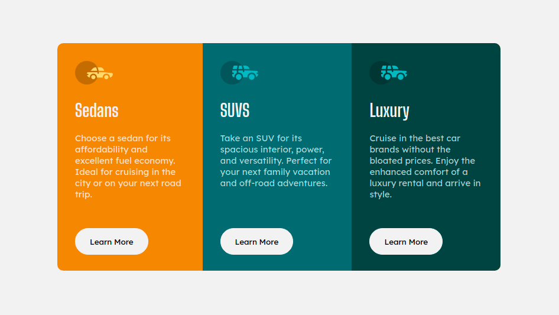

# Frontend Mentor - 3-column preview card component solution

This is a solution to the [3-column preview card component challenge on Frontend Mentor](https://www.frontendmentor.io/challenges/3column-preview-card-component-pH92eAR2-). Frontend Mentor challenges help you improve your coding skills by building realistic projects. 

## Table of contents

- [Overview](#overview)
  - [The challenge](#the-challenge)
  - [Screenshot](#screenshot)
  - [Links](#links)
- [My process](#my-process)
  - [Built with](#built-with)
  - [What I learned](#what-i-learned)
  - [Useful resources](#useful-resources)
- [Author](#author)

## Overview

### The challenge

Users should be able to:

- View the optimal layout depending on their device's screen size
- See hover states for interactive elements

### Screenshot



### Links

- Live Site URL: [Click here to view](https://sushil333.github.io/frontend-mentor/3-column-preview-card-component-main/)

## My process

### Built with

- HTML5 markup
- CSS custom properties
- Flexbox
- Mobile-first workflow

### What I learned

I have learned flex-box and grid. These are css attributes that make life so much easier, if you want to align or arrange element in certain way.

To see how you can add code snippets, see below:

```html
<div class="group-card">
  <div class="card">...</div>
  <div class="card">...</div>
  <div class="card">...</div>
</h1>
```
```css
.group-card {
  display: flex;
  flex-direction: row;  
  flex-wrap: nowrap;
  border-radius: 10px;
  overflow: hidden;   /* For bottom radius */
}
```

### Useful resources

- [W3School](https://www.w3schools.com/) - It has almost all the information about HTML, CSS, & JS.

## Author

- Website - [sbrocks.netlify.app](https://www.your-site.com)
- Frontend Mentor - [@Sushil333](https://www.frontendmentor.io/profile/Sushil333)
