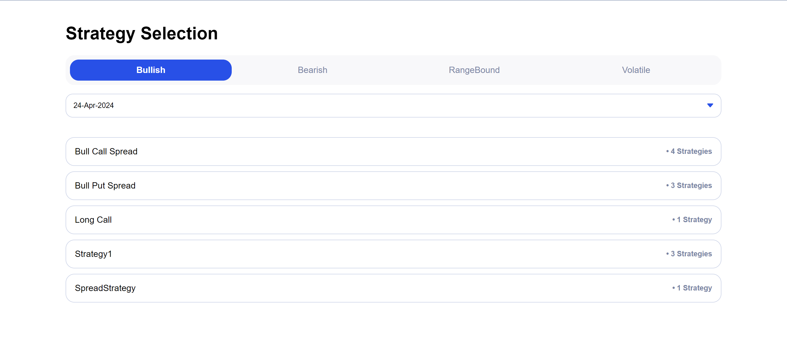

# Strategy Selection
Pure Vanilla JavaScript web app with filtering functionality with responsive UI.

## Table of contents
- [Overview](#overview)
  - [The challenge](#the-challenge)
  - [Screenshot](#screenshot)
  - [Links](#links)
- [Author](#author)

## Overview
This assignment has the objective to build a responsive UI to ensure that users can easily
interact with the page. Development should be done with the best possible optimal solution
without using any front-end libraries like Bootstrap. As well as taking care of debugging.
Assignment

### The challenge
- Render a toggle as shown in the image provided in Resources, representing four Views (Bullish, Bearish, RangeBound, Volatile). The default selection should be Bullish
- Render Date dropdown using the dateArray given in Resources. Render the First date as selected
- Render strategy cards below date dropdown using strategyArray provided in Resources.
- Cards should be rendered based on the selected date
- The card should contain 2 information (Strategy Name and Strategy Count). Strategy Count represents the number of occurrences of that name. eg: if Bull Call Spread appears 2 times in the array then its strategy count is 2. If the strategy count is 1 then label should be ‘Strategy’ otherwise ‘Strategies’
- If there are no cards for the selected date render the empty state with that date. provided in resources.

`
Note: UI should be working as mentioned but images, colors, and font styles can be close to the expected output but not necessary to match.
`

### Screenshot

### Links
- Live Demo URL: [Click here to view](https://sushil333.github.io/frontend-mentor/nerve-solutions/)

## Author
- Website - [Sushil Bhardwaj](https://sbrocks.netlify.app)
